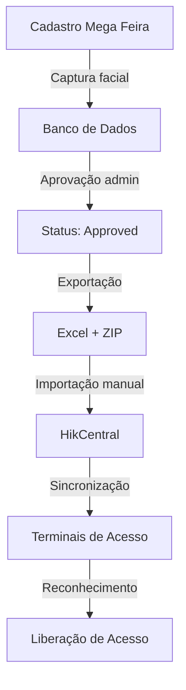

# 🔗 Guia Completo de Integração com HikCentral Professional

## 📋 Visão Geral

Este guia explica como integrar o sistema Mega Feira com o HikCentral Professional para permitir reconhecimento facial automático nos terminais de acesso aos estandes.

## 🎯 Objetivo

Sincronizar automaticamente os dados dos participantes aprovados (incluindo fotos faciais) com o sistema HikCentral Professional, permitindo que eles acessem os estandes usando reconhecimento facial.

## ✅ Pré-requisitos

1. **HikCentral Professional** instalado e rodando em `https://127.0.0.1`
2. **Credenciais de acesso** ao HikCentral (padrão: admin/Index2016)
3. **Participantes aprovados** no sistema Mega Feira
4. **Fotos faciais** capturadas durante o cadastro

## 🚀 Processo de Integração

### Etapa 1: Acessar Interface de Integração

1. Acesse o painel administrativo: `http://localhost:3000/admin`
2. Digite a senha de administrador: `admin123`
3. Clique em **"🔗 HikCentral"** no menu principal

### Etapa 2: Exportar Dados

Na página de integração do HikCentral:

1. Verifique o número de participantes aprovados prontos para exportação
2. Clique no botão verde **"⬇️ Exportar Tudo Agora"**
3. Aguarde o download de 2 arquivos:
   - `hikcentral-import-YYYY-MM-DD.xlsx` - Planilha Excel
   - `hikcentral-photos-YYYY-MM-DD.zip` - Arquivo ZIP com fotos

### Etapa 3: Preparar Arquivos

1. **Extrair as fotos**:
   ```
   - Crie uma pasta: C:\HikCentral\Import\Photos\
   - Extraia o conteúdo do ZIP nesta pasta
   - Verifique que as fotos estão nomeadas com CPF (ex: 12345678900.jpg)
   ```

2. **Manter o arquivo Excel**:
   - Não modifique o arquivo Excel gerado
   - Ele já está no formato oficial do HikCentral

### Etapa 4: Importar no HikCentral

1. **Abrir o HikCentral**:
   - Clique no botão **"🌐 Abrir HikCentral"** na interface
   - Ou acesse diretamente: `https://127.0.0.1`
   - Faça login com suas credenciais

2. **Navegar para importação**:
   ```
   Person → Person Management → Import (ou Batch Import)
   ```

3. **Configurar importação**:
   - Selecione o arquivo Excel baixado
   - Configure o caminho da pasta de fotos: `C:\HikCentral\Import\Photos\`
   - Verifique o mapeamento de colunas:
     - **Employee No.** = CPF (sem formatação)
     - **Name** = Nome completo
     - **Valid Begin Time** = Data de início (automática)
     - **Valid End Time** = Data de fim (90 dias)

4. **Executar importação**:
   - Clique em **"Import"**
   - Aguarde o processamento (pode levar alguns minutos)
   - Verifique o log de importação

### Etapa 5: Verificar Sucesso

1. **No HikCentral**:
   - Vá em **Person** → **Person Management**
   - Procure por alguns participantes pelo CPF ou nome
   - Verifique que as fotos estão associadas corretamente
   - Confirme o período de validade (90 dias a partir de hoje)

2. **No Sistema Mega Feira**:
   - Os participantes continuam no status "approved"
   - O sistema mantém registro de quais foram exportados

## 📊 Estrutura dos Dados Exportados

### Arquivo Excel

| Coluna | Descrição | Exemplo |
|--------|-----------|---------|
| Employee No. | CPF sem formatação | 12345678900 |
| Name | Nome completo | João Silva |
| Gender | Gênero (padrão: M) | M |
| Organization | Organização/Evento | MEGA-FEIRA-2025 |
| Phone | Telefone sem formatação | 11987654321 |
| Email | Email do participante | joao@email.com |
| Valid Begin Time | Data/hora de início | 2025/10/01 08:00:00 |
| Valid End Time | Data/hora de fim | 2026/01/01 23:59:59 |

### Arquivo ZIP de Fotos

```
hikcentral-photos-2025-10-01.zip
│
├── 12345678900.jpg   (CPF do participante 1)
├── 98765432100.jpg   (CPF do participante 2)
├── 11122233344.jpg   (CPF do participante 3)
└── ...
```

**Importante**: Os nomes dos arquivos DEVEM corresponder ao **Employee No.** no Excel.

## 🔧 Configuração Técnica

### Variáveis de Ambiente (.env.local)

```env
# HikCentral Configuration
HIKCENTAL_URL="https://127.0.0.1"
HIKCENTAL_USERNAME="admin"
HIKCENTAL_PASSWORD="Index2016"
HIKCENTAL_VALIDITY_DAYS="90"
```

### APIs Disponíveis

1. **Exportar Excel**:
   ```
   GET /api/admin/export-hikcentral?format=excel
   ```

2. **Exportar Fotos**:
   ```
   GET /api/admin/export-hikcentral?format=photos
   ```

3. **Listar Participantes Aprovados**:
   ```
   GET /api/admin/participants-full
   ```

## ⚠️ Problemas Comuns e Soluções

### 1. Fotos não aparecem no HikCentral

**Sintomas**:
- Participante importado, mas sem foto de perfil
- Reconhecimento facial não funciona

**Soluções**:
- Verifique se o caminho da pasta de fotos está correto
- Confirme que os nomes dos arquivos correspondem ao Employee No.
- Verifique que as fotos são JPG válidas
- Tente reimportar apenas as fotos

### 2. Erro "File format not supported"

**Sintomas**:
- HikCentral não aceita o arquivo Excel

**Soluções**:
- Certifique-se de usar o arquivo gerado pelo sistema (não modificado)
- Verifique a extensão: deve ser `.xlsx`
- Baixe novamente se necessário

### 3. Participante duplicado

**Sintomas**:
- Mensagem de erro sobre Employee No. já existente

**Soluções**:
- Isso é normal se estiver reimportando
- O HikCentral vai atualizar os dados existentes
- Para forçar nova importação, delete o participante existente primeiro

### 4. Período de validade incorreto

**Sintomas**:
- Participante com acesso expirado ou data errada

**Soluções**:
- Verifique se o sistema está com data/hora corretas
- Reexporte e reimporte os dados
- Ajuste manualmente no HikCentral se necessário

### 5. HikCentral não acessível

**Sintomas**:
- Erro de conexão ao tentar abrir https://127.0.0.1

**Soluções**:
- Verifique se o HikCentral Professional está rodando
- Confirme que o serviço está ativo (Windows Services)
- Tente acessar por IP alternativo se em rede

## 📱 Testando Reconhecimento Facial

Após importação bem-sucedida:

1. **Configurar Terminal de Acesso**:
   - Configure o terminal Hikvision (DS-K1T671M-L ou similar)
   - Conecte-o ao HikCentral
   - Sincronize a base de dados

2. **Testar Reconhecimento**:
   - Posicione um participante em frente ao terminal
   - Aguarde o reconhecimento (normalmente < 1 segundo)
   - Verifique a abertura da porta/liberação de acesso

3. **Monitorar Logs**:
   - No HikCentral: **Event and Alarm** → **Access Control Event**
   - Verifique eventos de reconhecimento facial bem-sucedidos

## 🔄 Fluxo Completo



## 📞 Suporte

### Logs do Sistema

**Next.js**:
```bash
# Ver logs do servidor
npm run dev
```

**HikCentral**:
- Acesse: **System** → **Maintenance** → **Log**
- Filtre por tipo: Access Control
- Procure por erros de importação ou reconhecimento

### Informações para Suporte

Ao reportar problemas, inclua:
- Número de participantes aprovados
- Data da última exportação
- Logs de erro do HikCentral
- Versão do HikCentral Professional
- Screenshots do erro (se houver)

## 🎓 Melhores Práticas

1. **Faça exportações regulares**:
   - Exporte diariamente ou após aprovar novos participantes
   - Mantenha backup dos arquivos Excel

2. **Valide antes de importar**:
   - Verifique o número de participantes no Excel
   - Confirme que todas as fotos foram extraídas
   - Teste com 1-2 participantes primeiro

3. **Monitore após importação**:
   - Verifique logs do HikCentral
   - Teste reconhecimento facial nos terminais
   - Ajuste configurações se necessário

4. **Mantenha sincronizado**:
   - Reexporte após aprovar novos participantes
   - Atualize dados se houver alterações
   - Remova participantes desabilitados/expirados

## ✅ Checklist de Importação

Use este checklist para garantir importação bem-sucedida:

- [ ] HikCentral Professional está rodando
- [ ] Tenho credenciais de acesso ao HikCentral
- [ ] Existem participantes aprovados no sistema
- [ ] Arquivo Excel foi exportado com sucesso
- [ ] Arquivo ZIP de fotos foi exportado
- [ ] Fotos foram extraídas para pasta específica
- [ ] Caminho da pasta está correto no HikCentral
- [ ] Mapeamento de colunas está configurado
- [ ] Importação foi executada sem erros
- [ ] Fotos aparecem nos perfis dos participantes
- [ ] Período de validade está correto (90 dias)
- [ ] Reconhecimento facial foi testado

---

## 📝 Notas Importantes

1. **Formato de Data**: O HikCentral espera datas no formato `YYYY/MM/DD HH:MM:SS`
2. **Employee No.**: Deve ser único e corresponder ao nome do arquivo de foto
3. **Tamanho de Foto**: Recomendado entre 100KB e 500KB por foto
4. **Formato de Foto**: JPG é preferido, PNG também suportado
5. **Validade**: Padrão de 90 dias conforme LGPD

---

**Desenvolvido para Mega Feira 2025** 🎉
**Sistema de Reconhecimento Facial Integrado**
