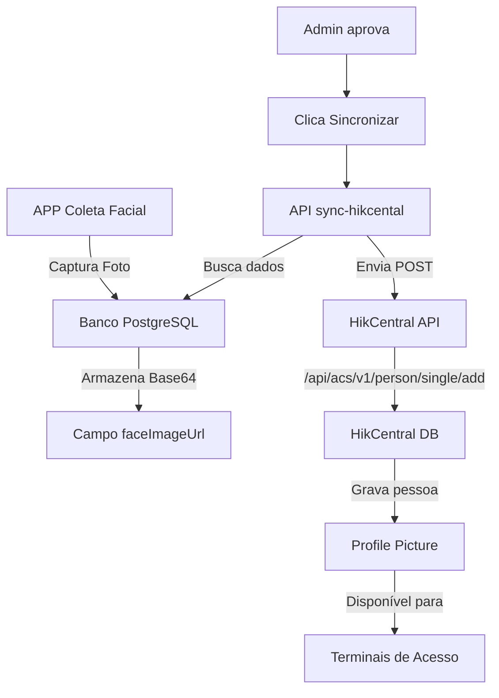

# 📡 Documentação da Integração HikCentral

## 🎯 Onde os dados estão sendo gravados no HikCentral?

### 1. **Endpoint Principal do HikCentral**
```
POST https://127.0.0.1/api/acs/v1/person/single/add
```

Este é o endpoint oficial da API HikCentral para adicionar uma nova pessoa ao sistema de controle de acesso.

### 2. **Dados Enviados ao HikCentral**

#### **Estrutura do JSON enviado:**
```json
{
  "employeeNo": "12345678900",      // CPF sem formatação
  "name": "João Silva",              // Nome completo
  "userType": "normal",              // Tipo de usuário
  "Valid": {
    "enable": true,                 // Habilitado
    "beginTime": "2025-08-25T00:00:00Z",  // Data inicial
    "endTime": "2025-11-23T23:59:59Z"     // Data final (90 dias)
  },
  "doorRight": "1",                 // Direito de acesso
  "RightPlan": [{
    "doorNo": 1,                    // Número da porta
    "planTemplateNo": "1"           // Template do plano
  }],
  "faceData": {                     // DADOS DA IMAGEM FACIAL
    "faceLibType": "blackFD",       // Tipo de biblioteca facial
    "libMatching": {
      "libID": "1",                 // ID da biblioteca
      "FDID": "1",                  // ID de detecção facial
      "FPID": "1"                  // ID de pontos faciais
    },
    "face": {
      "binaryData": "base64..."     // IMAGEM EM BASE64 AQUI!
    }
  }
}
```

### 3. **Onde a Imagem é Gravada no HikCentral**

A imagem facial capturada pelo APP é enviada para o HikCentral no campo:

**`faceData.face.binaryData`**

Este campo recebe a imagem em formato **Base64** e é armazenada diretamente no sistema HikCentral como a **foto de perfil** da pessoa.

### 4. **Como o HikCentral Processa a Imagem**

1. **Recebe** a imagem em Base64 no campo `binaryData`
2. **Decodifica** o Base64 para formato binário
3. **Armazena** no banco de dados interno
4. **Exibe** na interface como "Profile Picture"
5. **Usa** para reconhecimento facial nos terminais

## 🔧 Configuração Necessária

### **Arquivo `.env.local`:**
```env
# Configuração do HikCentral
HIKCENTAL_URL=https://127.0.0.1        # IP do servidor HikCentral
HIKCENTAL_USERNAME=admin                # Usuário admin do HikCentral
HIKCENTAL_PASSWORD=senha_do_hikcentral  # Senha do admin
```

### **Importante sobre o IP 127.0.0.1:**
- `127.0.0.1` é o localhost (mesma máquina)
- **Você precisa alterar para o IP real do seu servidor HikCentral**
- Exemplo: `https://192.168.1.100` ou `https://hikcentral.suaempresa.com`

## 📊 Fluxo Completo da Integração



## 🔍 Como Verificar se Está Funcionando

### 1. **No Console do Navegador (F12):**
Ao sincronizar, você verá:
```javascript
POST https://127.0.0.1/api/acs/v1/person/single/add
Status: 200 OK
Response: {
  "code": "0",
  "message": "Success",
  "data": {
    "personId": "HIK-12345",
    "employeeNo": "12345678900"
  }
}
```

### 2. **No Banco de Dados:**
```sql
SELECT 
  name,
  hikCentralSyncStatus,
  hikCentralPersonId,
  hikCentralSyncedAt
FROM participants
WHERE approvalStatus = 'approved';
```

### 3. **No HikCentral Professional:**
1. Acesse: **Access Control > Person Management**
2. Procure pelo CPF ou Nome
3. Verifique se a **Profile Picture** aparece
4. Confirme o **Person ID** gerado

## ⚠️ Possíveis Problemas e Soluções

### **Erro: "Request failed with status code 404"**
- **Causa**: URL do HikCentral incorreta
- **Solução**: Verifique o IP e porta do servidor

### **Erro: "Connection timeout"**
- **Causa**: Servidor HikCentral inacessível
- **Solução**: 
  - Verificar se o servidor está online
  - Verificar firewall/portas
  - Testar com `ping IP_DO_HIKCENTRAL`

### **Erro: "Authentication failed"**
- **Causa**: Credenciais incorretas
- **Solução**: Verificar usuário e senha no `.env.local`

### **Imagem não aparece no HikCentral:**
- **Causa**: Formato incorreto ou imagem corrompida
- **Solução**: 
  - Verificar se o Base64 está completo
  - Testar decodificar o Base64
  - Verificar tamanho máximo aceito

## 📱 Teste Manual via cURL

Para testar manualmente a integração:

```bash
curl -X POST https://SEU_IP_HIKCENTRAL/api/acs/v1/person/single/add \
  -u admin:senha \
  -H "Content-Type: application/json" \
  -d '{
    "employeeNo": "12345678900",
    "name": "Teste Manual",
    "userType": "normal",
    "Valid": {
      "enable": true,
      "beginTime": "2025-08-25T00:00:00Z",
      "endTime": "2025-11-23T23:59:59Z"
    },
    "faceData": {
      "faceLibType": "blackFD",
      "face": {
        "binaryData": "BASE64_DA_IMAGEM_AQUI"
      }
    }
  }'
```

## 🚀 Resumo

**A imagem facial é gravada no HikCentral através de:**

1. **Endpoint**: `/api/acs/v1/person/single/add`
2. **Campo**: `faceData.face.binaryData`
3. **Formato**: Base64
4. **Destino**: Profile Picture no sistema HikCentral
5. **Uso**: Reconhecimento facial nos terminais de acesso

---

📌 **Nota**: Certifique-se de configurar o IP correto do seu servidor HikCentral no arquivo `.env.local`!