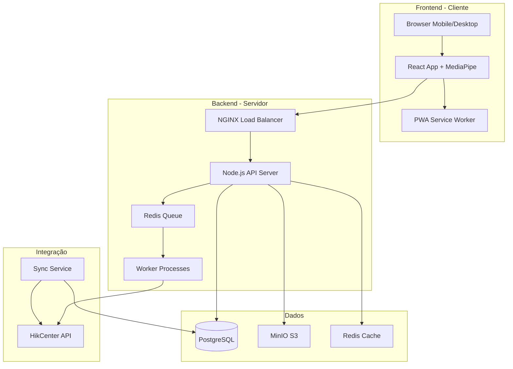
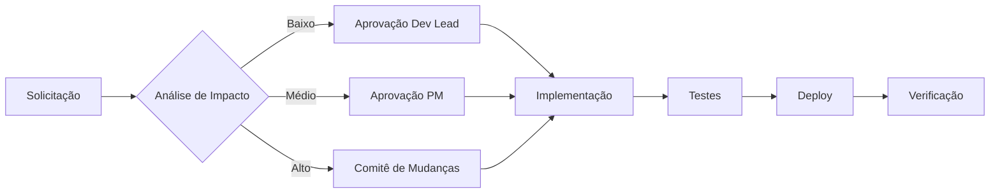

# Plano de Projeto Completo - Sistema de Cadastro Facial para Eventos

## 📋 Sumário Executivo

### Informações do Projeto
- **Nome do Projeto:** Sistema de Cadastro Facial para Eventos
- **Código do Projeto:** SCFE-2025
- **Versão do Documento:** 1.0
- **Data de Criação:** 08/08/2025
- **Responsável Técnico:** [Nome do Responsável]
- **Cliente/Evento:** [Nome do Evento]

### Escopo do Projeto
Desenvolvimento de sistema web responsivo para coleta de dados biométricos faciais de até 2.000 participantes de evento, com integração ao HikCenter para controle de acesso via reconhecimento facial.

### Objetivos Principais
1. ✅ Captura facial via navegador mobile (Android/iOS)
2. ✅ Coleta de dados pessoais (Nome, CPF, códigos)
3. ✅ Integração com HikCenter Professional
4. ✅ Conformidade total com LGPD
5. ✅ Interface amigável e acessível

---

## 📊 1. PLANO DE PROJETO

### 1.1 Estrutura Analítica do Projeto (EAP)

```
SCFE-2025
├── 1. Iniciação
│   ├── 1.1 Definição de Requisitos
│   ├── 1.2 Análise de Viabilidade
│   └── 1.3 Aprovação do Projeto
├── 2. Planejamento
│   ├── 2.1 Arquitetura Técnica
│   ├── 2.2 Design UI/UX
│   └── 2.3 Plano de Segurança
├── 3. Execução
│   ├── 3.1 Desenvolvimento Frontend
│   ├── 3.2 Desenvolvimento Backend
│   ├── 3.3 Integração HikCenter
│   └── 3.4 Implementação LGPD
├── 4. Testes
│   ├── 4.1 Testes Unitários
│   ├── 4.2 Testes de Integração
│   ├── 4.3 Testes de Carga
│   └── 4.4 Testes de Segurança
└── 5. Encerramento
    ├── 5.1 Deploy em Produção
    ├── 5.2 Treinamento
    └── 5.3 Documentação Final
```

### 1.2 Cronograma Master

| Fase | Início | Término | Duração | Entregáveis |
|------|--------|---------|---------|-------------|
| **Fase 1: Iniciação** | 12/08/2025 | 16/08/2025 | 5 dias | Documento de Requisitos, Charter do Projeto |
| **Fase 2: Design** | 19/08/2025 | 30/08/2025 | 10 dias | Protótipos, Arquitetura, Fluxos UX |
| **Fase 3: Desenvolvimento MVP** | 02/09/2025 | 27/09/2025 | 20 dias | Sistema funcional básico |
| **Fase 4: Integração HikCenter** | 30/09/2025 | 11/10/2025 | 10 dias | API integrada, Sincronização |
| **Fase 5: Segurança e LGPD** | 14/10/2025 | 25/10/2025 | 10 dias | Compliance implementado |
| **Fase 6: Testes** | 28/10/2025 | 08/11/2025 | 10 dias | Relatórios de teste |
| **Fase 7: Deploy** | 11/11/2025 | 15/11/2025 | 5 dias | Sistema em produção |
| **Fase 8: Treinamento** | 18/11/2025 | 22/11/2025 | 5 dias | Usuários capacitados |
| **Buffer de Contingência** | - | - | 5 dias | - |
| **TOTAL** | 12/08/2025 | 22/11/2025 | 70 dias úteis | Sistema completo |

### 1.3 Matriz RACI

| Atividade | PM | Dev Front | Dev Back | DBA | Security | Cliente |
|-----------|----|-----------| ---------|-----|----------|---------|
| Requisitos | A | C | C | I | C | R |
| Arquitetura | A | C | R | C | C | I |
| UI/UX Design | A | R | I | - | I | C |
| Desenvolvimento Frontend | A | R | C | - | I | I |
| Desenvolvimento Backend | A | C | R | C | I | I |
| Banco de Dados | A | I | C | R | C | I |
| Integração HikCenter | A | C | R | I | C | C |
| Segurança/LGPD | A | C | C | C | R | A |
| Testes | R | C | C | I | C | I |
| Deploy | A | C | R | C | C | I |

*R=Responsável, A=Aprovador, C=Consultado, I=Informado*

---

## 📐 2. ARQUITETURA TÉCNICA

### 2.1 Diagrama de Arquitetura



### 2.2 Fluxo de Dados

```yaml
1. Captura Facial:
   - Browser → MediaPipe → Validação local
   - Canvas snapshot → Base64 encoding
   - Compressão client-side (WebP/JPEG)

2. Envio ao Backend:
   - POST /api/registration
   - Multipart form data
   - JWT token temporário

3. Processamento:
   - Validação de qualidade
   - Extração de template biométrico
   - Criptografia AES-256
   - Armazenamento distribuído

4. Sincronização HikCenter:
   - Batch processing (100 registros)
   - Retry com backoff exponencial
   - Confirmação de importação
```

### 2.3 Especificações de API

```typescript
// POST /api/v1/registration
interface RegistrationRequest {
  personalData: {
    name: string;
    cpf: string;
    eventCode?: string;
    additionalCodes?: string[];
  };
  biometricData: {
    faceImage: string; // Base64
    captureMetadata: {
      timestamp: string;
      device: string;
      quality: number;
    };
  };
  consent: {
    accepted: boolean;
    timestamp: string;
    ipAddress: string;
  };
}

// Response
interface RegistrationResponse {
  success: boolean;
  registrationId: string;
  qrCode?: string;
  message: string;
  hikCenterStatus?: 'pending' | 'synced' | 'error';
}
```

---

## 🔒 3. PLANO DE SEGURANÇA E LGPD

### 3.1 Requisitos de Conformidade LGPD

#### Bases Legais
- **Base Legal Principal:** Consentimento (Art. 7º, I)
- **Base Legal Secundária:** Execução de contrato (Art. 7º, V)
- **Categoria de Dados:** Dados pessoais sensíveis (biométricos)

#### Medidas Técnicas Obrigatórias
1. **Criptografia**
   - Algoritmo: AES-256-GCM
   - Key Management: HashiCorp Vault
   - TLS 1.3 para transmissão

2. **Anonimização**
   - Templates biométricos separados de PII
   - Tokenização de CPF
   - Pseudonimização para logs

3. **Controle de Acesso**
   ```yaml
   Roles:
     - admin: Full access
     - operator: Read/Write registrations
     - viewer: Read only
     - system: API access only
   
   MFA obrigatório para:
     - Acesso administrativo
     - Exportação de dados
     - Configurações de sistema
   ```

### 3.2 Documento de Impacto à Proteção de Dados (RIPD)

#### Identificação do Tratamento
- **Finalidade:** Controle de acesso a evento via reconhecimento facial
- **Volume:** Até 2.000 titulares
- **Duração:** 90 dias após o evento
- **Compartilhamento:** HikCenter (processador)

#### Matriz de Riscos

| Risco | Probabilidade | Impacto | Mitigação |
|-------|---------------|---------|-----------|
| Vazamento de dados biométricos | Baixa | Muito Alto | Criptografia, WAF, Pen testing |
| Acesso não autorizado | Média | Alto | MFA, RBAC, Logs de auditoria |
| Falha na exclusão de dados | Baixa | Alto | Jobs automatizados, verificação |
| Uso indevido de dados | Baixa | Muito Alto | Consent management, Auditoria |
| Indisponibilidade do sistema | Média | Médio | HA, Backup, DR plan |

### 3.3 Termos e Políticas

#### Termo de Consentimento
```markdown
# TERMO DE CONSENTIMENTO PARA TRATAMENTO DE DADOS BIOMÉTRICOS

## 1. IDENTIFICAÇÃO
Eu, [NOME COMPLETO], CPF [XXX.XXX.XXX-XX], AUTORIZO o tratamento 
de meus dados pessoais e biométricos para fins de controle de acesso 
ao evento [NOME DO EVENTO].

## 2. DADOS COLETADOS
- Nome completo e CPF
- Fotografia facial para extração de template biométrico
- Metadados de captura (data, hora, dispositivo)

## 3. FINALIDADE
Exclusivamente para identificação e controle de acesso ao evento 
através de terminais de reconhecimento facial.

## 4. PRAZO DE ARMAZENAMENTO
Os dados serão mantidos por 90 dias após o término do evento, 
sendo automaticamente excluídos após este período.

## 5. SEUS DIREITOS
Você pode, a qualquer momento:
- Solicitar acesso aos seus dados
- Corrigir dados incorretos
- Revogar este consentimento
- Solicitar exclusão dos dados
- Solicitar portabilidade

## 6. SEGURANÇA
Seus dados são criptografados e armazenados com segurança, 
em conformidade com a LGPD e melhores práticas de segurança.

[ ] Li e concordo com os termos acima
Data: ___/___/______
```

---

## 🧪 4. PLANO DE TESTES

### 4.1 Estratégia de Testes

```yaml
Pyramid Testing:
  Unit Tests: 70%
    - Components React
    - Funções utilitárias
    - Validações
    
  Integration Tests: 20%
    - API endpoints
    - Database operations
    - HikCenter sync
    
  E2E Tests: 10%
    - Fluxo completo de cadastro
    - Cross-browser testing
    - Mobile testing
```

### 4.2 Casos de Teste Críticos

| ID | Caso de Teste | Pré-condições | Passos | Resultado Esperado |
|----|---------------|---------------|---------|-------------------|
| TC001 | Captura facial em Android Chrome | Dispositivo Android 8+ | 1. Acessar site<br>2. Permitir câmera<br>3. Capturar face | Imagem capturada com sucesso |
| TC002 | Captura facial em iOS Safari | iPhone com iOS 14+ | 1. Acessar site<br>2. Permitir câmera<br>3. Capturar face | Imagem capturada com sucesso |
| TC003 | Validação de CPF | Campo CPF visível | 1. Inserir CPF inválido<br>2. Submeter | Erro de validação exibido |
| TC004 | Sync com HikCenter | Registro completo | 1. Completar cadastro<br>2. Aguardar sync | Status "synced" em < 30s |
| TC005 | Teste de carga | Sistema em produção | 1. Simular 100 cadastros simultâneos | Todos processados < 5s cada |

### 4.3 Plano de Testes de Performance

```javascript
// k6 Load Test Script
import http from 'k6/http';
import { check, sleep } from 'k6';

export let options = {
  stages: [
    { duration: '2m', target: 50 },  // Ramp up
    { duration: '5m', target: 100 }, // Stay at 100 users
    { duration: '2m', target: 200 }, // Peak load
    { duration: '2m', target: 0 },   // Ramp down
  ],
  thresholds: {
    http_req_duration: ['p(95)<3000'], // 95% < 3s
    http_req_failed: ['rate<0.05'],    // Error rate < 5%
  },
};

export default function() {
  // Test registration endpoint
  let response = http.post('https://api.evento.com/registration', {
    // Test data
  });
  
  check(response, {
    'status is 200': (r) => r.status === 200,
    'registration successful': (r) => JSON.parse(r.body).success === true,
  });
  
  sleep(1);
}
```

---

## 📚 5. DOCUMENTAÇÃO TÉCNICA

### 5.1 README.md Principal

```markdown
# Sistema de Cadastro Facial para Eventos

## 🚀 Quick Start

### Pré-requisitos
- Node.js 20+
- PostgreSQL 15+
- Redis 7+
- Docker & Docker Compose

### Instalação

\`\`\`bash
# Clone o repositório
git clone https://github.com/empresa/facial-registration.git
cd facial-registration

# Instale as dependências
npm install

# Configure as variáveis de ambiente
cp .env.example .env
# Edite .env com suas configurações

# Inicie os serviços
docker-compose up -d

# Execute as migrations
npm run db:migrate

# Inicie o servidor de desenvolvimento
npm run dev
\`\`\`

### Estrutura do Projeto

\`\`\`
facial-registration/
├── frontend/          # React application
├── backend/           # Node.js API
├── database/          # Migrations e seeds
├── docker/            # Docker configurations
├── docs/              # Documentação
├── tests/             # Testes automatizados
└── scripts/           # Scripts utilitários
\`\`\`

## 📖 Documentação

- [Arquitetura](./docs/ARCHITECTURE.md)
- [API Reference](./docs/API.md)
- [Guia de Contribuição](./docs/CONTRIBUTING.md)
- [Segurança](./docs/SECURITY.md)

## 🔒 Segurança

Este projeto está em conformidade com a LGPD. 
Veja [SECURITY.md](./docs/SECURITY.md) para mais detalhes.

## 📝 Licença

Proprietary - Todos os direitos reservados
```

### 5.2 Documentação da API (OpenAPI 3.0)

```yaml
openapi: 3.0.0
info:
  title: Facial Registration API
  version: 1.0.0
  description: API para cadastro facial de participantes

servers:
  - url: https://api.evento.com/v1
    description: Production
  - url: http://localhost:3000/v1
    description: Development

paths:
  /registration:
    post:
      summary: Registrar novo participante
      requestBody:
        required: true
        content:
          multipart/form-data:
            schema:
              type: object
              properties:
                name:
                  type: string
                  minLength: 3
                  maxLength: 100
                cpf:
                  type: string
                  pattern: '^[0-9]{11}$'
                faceImage:
                  type: string
                  format: binary
                eventCode:
                  type: string
                consent:
                  type: boolean
      responses:
        201:
          description: Registro criado com sucesso
        400:
          description: Dados inválidos
        500:
          description: Erro interno

  /registration/{id}:
    get:
      summary: Consultar registro
      parameters:
        - name: id
          in: path
          required: true
          schema:
            type: string
      responses:
        200:
          description: Registro encontrado
        404:
          description: Registro não encontrado

  /hikcenter/sync:
    post:
      summary: Sincronizar com HikCenter
      security:
        - ApiKeyAuth: []
      responses:
        200:
          description: Sincronização iniciada
        401:
          description: Não autorizado
```

---

## 🚀 6. PLANO DE DEPLOY

### 6.1 Checklist de Deploy

#### Pre-Deploy
- [ ] Todos os testes passando (coverage > 80%)
- [ ] Code review aprovado
- [ ] Documentação atualizada
- [ ] Backup do banco realizado
- [ ] Variáveis de ambiente configuradas
- [ ] Certificados SSL válidos
- [ ] DNS configurado

#### Deploy Steps
```bash
#!/bin/bash
# deploy.sh

echo "🚀 Iniciando deploy..."

# 1. Build da aplicação
npm run build

# 2. Run tests
npm test

# 3. Build Docker images
docker build -t facial-app:latest .

# 4. Push to registry
docker push registry.empresa.com/facial-app:latest

# 5. Deploy to Kubernetes
kubectl apply -f k8s/

# 6. Run migrations
kubectl exec -it facial-app -- npm run db:migrate

# 7. Health check
curl https://api.evento.com/health

echo "✅ Deploy concluído!"
```

#### Post-Deploy
- [ ] Verificar logs de aplicação
- [ ] Testar fluxo completo em produção
- [ ] Verificar métricas de performance
- [ ] Confirmar backup automático
- [ ] Notificar stakeholders

### 6.2 Plano de Rollback

```yaml
Trigger de Rollback:
  - Error rate > 10%
  - Response time > 5s
  - Crash loops detectados
  - Falha crítica reportada

Procedimento:
  1. Identificar versão anterior estável
  2. kubectl rollout undo deployment/facial-app
  3. Verificar restored state
  4. Investigar root cause
  5. Documentar incidente
```

---

## 📊 7. MONITORAMENTO E KPIs

### 7.1 Métricas de Negócio

| KPI | Meta | Medição | Frequência |
|-----|------|---------|------------|
| Taxa de Cadastro Bem-sucedido | > 95% | Cadastros completos / Total tentativas | Real-time |
| Tempo Médio de Cadastro | < 60s | Média do tempo total | Diário |
| Taxa de Sincronização HikCenter | > 99% | Syncs sucesso / Total | Horário |
| Satisfação do Usuário | > 4.5/5 | NPS Survey | Por evento |

### 7.2 Métricas Técnicas

```yaml
Application Metrics:
  - Request rate (req/s)
  - Response time (p50, p95, p99)
  - Error rate (4xx, 5xx)
  - Active users
  - Face detection success rate

Infrastructure Metrics:
  - CPU usage (< 70%)
  - Memory usage (< 80%)
  - Disk I/O
  - Network latency
  - Database connections

Security Metrics:
  - Failed authentication attempts
  - Data access logs
  - Encryption status
  - Vulnerability scan results
```

### 7.3 Dashboard de Monitoramento

```javascript
// Grafana Dashboard Config
{
  "dashboard": {
    "title": "Facial Registration Monitor",
    "panels": [
      {
        "title": "Registrations per Hour",
        "type": "graph",
        "targets": [
          {
            "expr": "rate(registrations_total[1h])"
          }
        ]
      },
      {
        "title": "API Response Time",
        "type": "graph",
        "targets": [
          {
            "expr": "histogram_quantile(0.95, http_request_duration_seconds)"
          }
        ]
      },
      {
        "title": "HikCenter Sync Status",
        "type": "stat",
        "targets": [
          {
            "expr": "hikcenter_sync_success_rate"
          }
        ]
      }
    ]
  }
}
```

---

## 👥 8. PLANO DE TREINAMENTO

### 8.1 Público-Alvo e Conteúdo

| Público | Duração | Conteúdo | Formato |
|---------|---------|----------|---------|
| **Operadores do Sistema** | 4h | - Cadastro de participantes<br>- Resolução de problemas<br>- Consultas e relatórios | Presencial + Hands-on |
| **Administradores** | 2h | - Configurações<br>- Gestão de usuários<br>- Backup e recovery | Online + Documentação |
| **Suporte Técnico** | 6h | - Troubleshooting<br>- Logs e monitoramento<br>- Integração HikCenter | Workshop técnico |
| **Participantes** | - | - Vídeo tutorial (2min)<br>- FAQ online | Self-service |

### 8.2 Material de Treinamento

#### Manual do Operador
```markdown
# MANUAL DO OPERADOR - Sistema de Cadastro Facial

## 1. ACESSO AO SISTEMA
1. Acesse https://cadastro.evento.com
2. Faça login com suas credenciais
3. Dashboard principal será exibido

## 2. AUXILIAR PARTICIPANTE NO CADASTRO
### Passo 1: Dados Pessoais
- Solicite nome completo
- Confirme CPF (validação automática)
- Insira código do evento se aplicável

### Passo 2: Captura Facial
- Posicione o participante de frente para a câmera
- Aguarde o círculo ficar verde
- Clique em "Capturar"
- Confirme qualidade da imagem

### Passo 3: Finalização
- Revise os dados com o participante
- Obtenha consentimento verbal
- Clique em "Confirmar Cadastro"
- Forneça o QR Code gerado

## 3. PROBLEMAS COMUNS

### "Câmera não detectada"
- Verifique permissões do navegador
- Teste em outro navegador
- Reinicie o dispositivo

### "Falha na captura facial"
- Melhore iluminação
- Remova óculos escuros
- Posicione melhor o rosto

### "Erro de sincronização"
- Aguarde 30 segundos
- Tente novamente
- Contate suporte se persistir
```

---

## 📈 9. GESTÃO DE MUDANÇAS

### 9.1 Processo de Controle de Mudanças



### 9.2 Template de Solicitação de Mudança

```yaml
Change Request #: CR-2025-XXX
Date: DD/MM/YYYY
Requestor: [Nome]
Priority: [Low/Medium/High/Critical]

Description:
  What: [O que precisa mudar]
  Why: [Justificativa]
  Impact: [Sistemas afetados]

Risk Assessment:
  - Technical Risk: [Low/Medium/High]
  - Business Risk: [Low/Medium/High]
  - Security Risk: [Low/Medium/High]

Implementation Plan:
  - Dev Hours: [Estimativa]
  - Test Hours: [Estimativa]
  - Deploy Window: [Data/Hora]

Rollback Plan:
  [Descrição do plano de rollback]

Approvals:
  - Dev Lead: [ ] Date: ___
  - PM: [ ] Date: ___
  - Security: [ ] Date: ___
```

---

## 🎯 10. CRITÉRIOS DE ACEITAÇÃO

### 10.1 Checklist de Entrega Final

#### Funcionalidades Core
- [ ] Captura facial funciona em Android Chrome
- [ ] Captura facial funciona em iOS Safari
- [ ] Validação de CPF implementada
- [ ] Dados salvos no PostgreSQL
- [ ] Imagens armazenadas no MinIO
- [ ] Sincronização com HikCenter operacional
- [ ] Sistema de filas Redis funcionando

#### Segurança e Compliance
- [ ] Dados biométricos criptografados
- [ ] HTTPS implementado
- [ ] Termo de consentimento funcional
- [ ] Logs de auditoria ativos
- [ ] Backup automático configurado
- [ ] Exclusão automática após 90 dias

#### Performance
- [ ] Suporta 100 usuários simultâneos
- [ ] Tempo de resposta < 3s (p95)
- [ ] Disponibilidade > 99.9%
- [ ] Taxa de erro < 1%

#### Documentação
- [ ] README.md completo
- [ ] API documentada
- [ ] Manual do usuário
- [ ] Runbook operacional
- [ ] Documentação LGPD

### 10.2 Definição de "Pronto"

```yaml
Definition of Done:
  Code:
    - Funcionalidade implementada
    - Code review aprovado
    - Sem bugs críticos
    - Coverage > 80%
    
  Testing:
    - Unit tests passando
    - Integration tests passando
    - UAT aprovado
    
  Documentation:
    - Código comentado
    - README atualizado
    - API docs atualizada
    
  Deployment:
    - Deployed em staging
    - Performance validada
    - Security scan passed
```

---

## 📞 11. COMUNICAÇÃO E SUPORTE

### 11.1 Plano de Comunicação

| Stakeholder | Frequência | Canal | Conteúdo |
|-------------|------------|-------|----------|
| Sponsor | Semanal | Email | Status Report |
| Cliente | Bi-semanal | Reunião | Demo + Progress |
| Equipe Dev | Diária | Slack/Stand-up | Daily updates |
| Usuários | Por marco | Email/Portal | Release notes |

### 11.2 Estrutura de Suporte

```yaml
Níveis de Suporte:
  L1 - Help Desk:
    - Horário: 8h-18h
    - SLA: 2 horas
    - Escopo: Dúvidas básicas, reset senha
    
  L2 - Suporte Técnico:
    - Horário: 8h-20h
    - SLA: 4 horas
    - Escopo: Problemas técnicos, bugs
    
  L3 - Desenvolvimento:
    - Horário: On-call
    - SLA: 8 horas
    - Escopo: Bugs críticos, indisponibilidade

Canais de Contato:
  - Email: suporte@facial-evento.com
  - WhatsApp: +55 51 9XXXX-XXXX
  - Portal: https://suporte.facial-evento.com
```

### 11.3 FAQ - Perguntas Frequentes

```markdown
## FAQ - Sistema de Cadastro Facial

### P: O sistema funciona em qualquer celular?
R: Sim, funciona em smartphones Android (versão 8+) e iPhone (iOS 14+) 
com câmera frontal.

### P: Meus dados estão seguros?
R: Sim, utilizamos criptografia de ponta a ponta e seguimos a LGPD. 
Seus dados são automaticamente excluídos 90 dias após o evento.

### P: Posso fazer o cadastro com óculos?
R: Sim, mas óculos escuros devem ser removidos. Óculos de grau 
podem permanecer.

### P: O que fazer se a câmera não abrir?
R: Verifique se você permitiu o acesso à câmera quando solicitado. 
Nas configurações do navegador, permita acesso para o site do evento.

### P: Posso excluir meus dados antes do evento?
R: Sim, envie um email para privacidade@evento.com com seu CPF 
solicitando a exclusão.

### P: É obrigatório fazer o cadastro facial?
R: O cadastro facial é o método principal de acesso ao evento. 
Casos especiais podem ser tratados individualmente.
```

---

## 🔄 12. MANUTENÇÃO E EVOLUÇÃO

### 12.1 Plano de Manutenção

| Tipo | Frequência | Janela | Atividades |
|------|------------|--------|------------|
| **Preventiva** | Mensal | Dom 00:00-04:00 | Updates OS, patches segurança |
| **Corretiva** | Sob demanda | Acordo SLA | Bug fixes, hotfixes |
| **Evolutiva** | Trimestral | Planejada | Novas features, melhorias |
| **Adaptativa** | Anual | Planejada | Upgrades major, refactoring |

### 12.2 Roadmap de Evolução

```markdown
## Q1 2026
- [ ] Integração com mais sistemas de controle de acesso
- [ ] App mobile nativo (React Native)
- [ ] Multi-idioma (EN, ES)

## Q2 2026
- [ ] Dashboard analytics avançado
- [ ] Reconhecimento facial com máscaras
- [ ] API pública para parceiros

## Q3 2026
- [ ] Machine Learning para detecção de fraudes
- [ ] Integração com sistemas de pagamento
- [ ] White-label solution

## Q4 2026
- [ ] Blockchain para auditoria
- [ ] Expansion internacional
- [ ] ISO 27001 certification
```

---

## 📋 13. ANEXOS E TEMPLATES

### 13.1 Template de Status Report

```markdown
# STATUS REPORT - SEMANA [XX]
**Período:** DD/MM a DD/MM/2025
**Projeto:** Sistema de Cadastro Facial

## RESUMO EXECUTIVO
[Breve resumo do status geral - 2-3 linhas]

## PROGRESSO
### Concluído esta semana:
- ✅ [Item 1]
- ✅ [Item 2]

### Em andamento:
- 🔄 [Item 1] - 75% completo
- 🔄 [Item 2] - 50% completo

### Próxima semana:
- 📋 [Item 1]
- 📋 [Item 2]

## MÉTRICAS
- **Progresso Geral:** XX%
- **Budget Utilizado:** R$ XX.XXX
- **Horas Gastas:** XXX/XXX

## RISCOS E ISSUES
| Tipo | Descrição | Impacto | Ação |
|------|-----------|---------|------|
| Risk | [Descrição] | Alto | [Mitigação] |
| Issue | [Descrição] | Médio | [Resolução] |

## NECESSIDADES
- [Decisão necessária]
- [Recurso necessário]
```

### 13.2 Checklist de Go-Live

```markdown
## GO-LIVE CHECKLIST

### 2 Semanas Antes
- [ ] Freeze de features
- [ ] Testes de carga completos
- [ ] Pen testing finalizado
- [ ] Documentação revisada
- [ ] Treinamento agendado

### 1 Semana Antes
- [ ] Deploy em staging
- [ ] UAT sign-off
- [ ] Backup plan confirmado
- [ ] Runbook atualizado
- [ ] Comunicação enviada

### 1 Dia Antes
- [ ] Backup completo
- [ ] Health checks
- [ ] Team briefing
- [ ] Suporte em standby
- [ ] Rollback testado

### Dia do Go-Live
- [ ] Deploy em produção
- [ ] Smoke tests
- [ ] Monitoramento ativo
- [ ] Comunicação de sucesso
- [ ] Celebration! 🎉
```

---

## 📝 CONTROLE DE VERSÕES DO DOCUMENTO

| Versão | Data | Autor | Mudanças |
|--------|------|-------|----------|
| 1.0 | 08/08/2025 | [Nome] | Documento inicial |
| 1.1 | - | - | - |

---

## ✅ APROVAÇÕES

| Papel | Nome | Assinatura | Data |
|-------|------|------------|------|
| Sponsor | | | |
| Project Manager | | | |
| Tech Lead | | | |
| Security Officer | | | |
| DPO (LGPD) | | | |

---

**FIM DO DOCUMENTO**

*Este documento contém informações confidenciais e proprietárias.*
*Distribuição restrita aos stakeholders do projeto.*